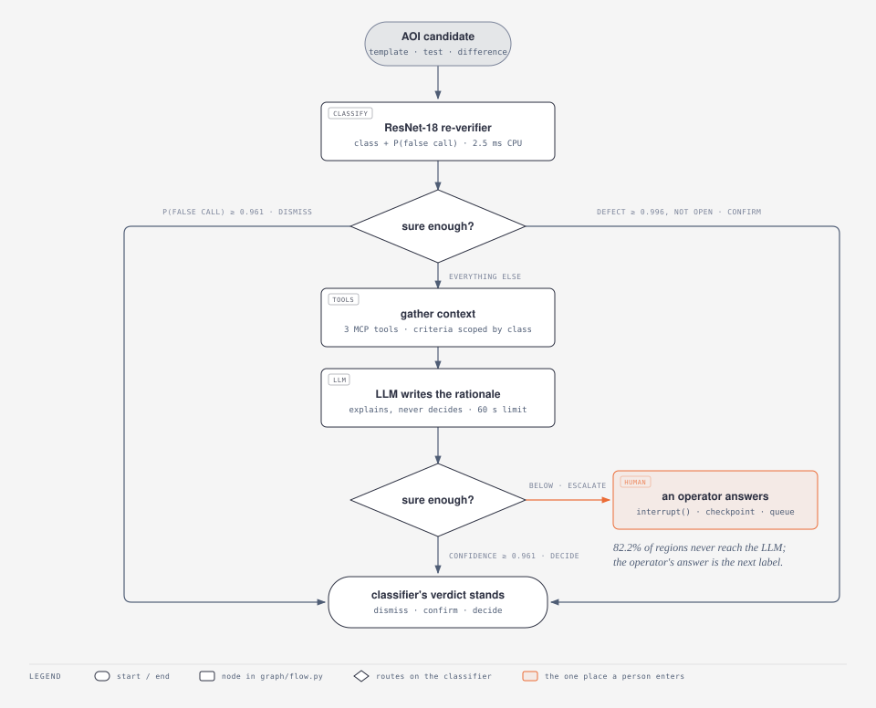
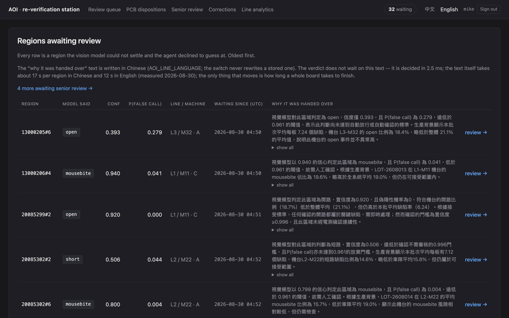
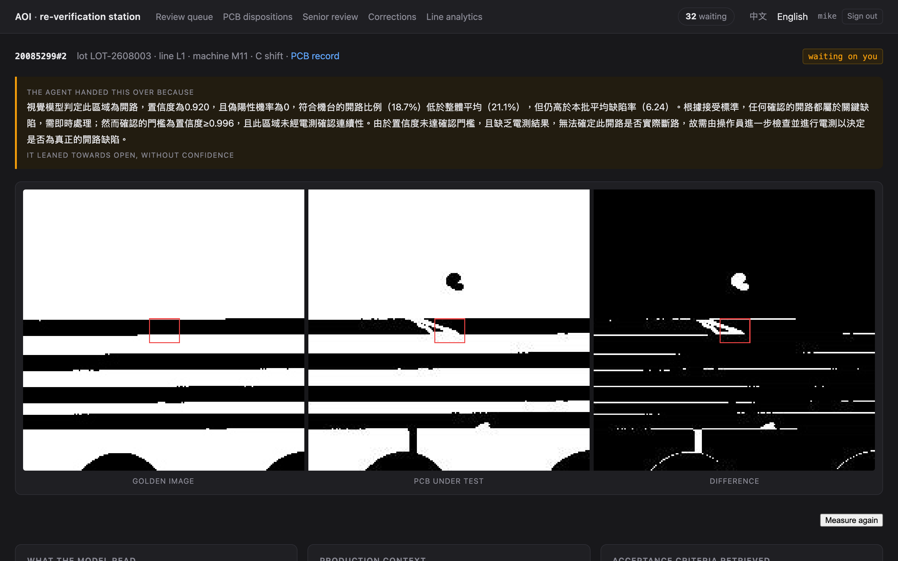
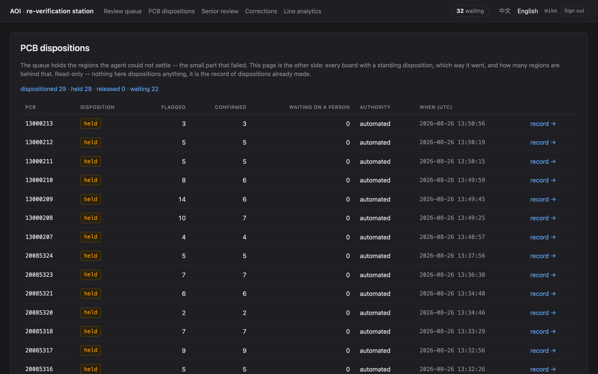
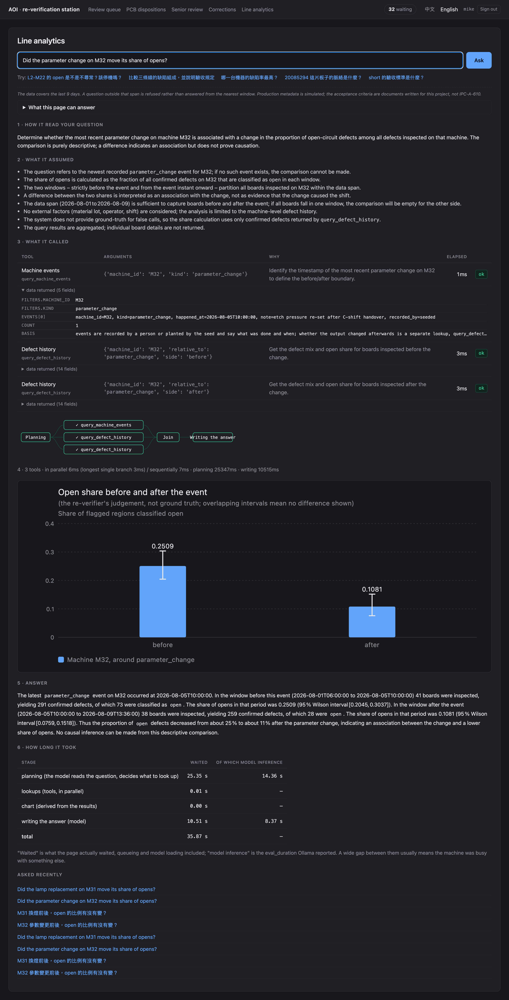
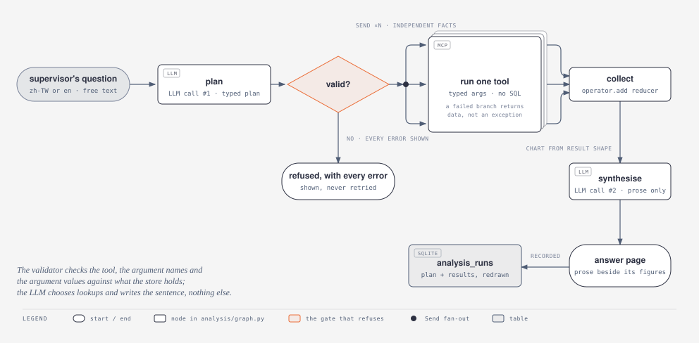

# AOI-Agent

PCB AOI re-verification: a vision model in front of the operator queue, an
agent behind it, and a benchmark for every claim.

[](https://github.com/lin891020/aoi-agent/actions/workflows/tests.yml)


&nbsp; **[繁體中文版 →](README.zh-TW.md)**

<picture>
  <source media="(prefers-color-scheme: dark)" srcset="docs/diagrams/disposition-flow-dark.svg">
  
</picture>

<sub>Disposition flow. Rendered from the node names and thresholds in `graph/flow.py` by `scripts/render_diagrams.py`. The `/ask` flow is drawn under [Asking the line a question](#asking-the-line-a-question--ask).</sub>

## Overview

| Aspect | Summary |
|---|---|
| **Problem** | Production AOI is tuned for recall and over-flags. Every flagged region is reviewed by a person; most are false calls. |
| **Approach** | A ResNet-18 re-verifier scores each candidate. A LangGraph flow gathers context and an LLM rationale for the uncertain ones and escalates what it cannot settle to an operator through a durable `interrupt()`. A second entrance, `/ask`, turns a supervisor's question into a validated plan of typed lookups and a chart. |
| **Data** | [DeepPCB](https://github.com/tangsanli5201/DeepPCB), official split: 7,322 candidates from 499 test boards, 41.2% genuine defects. False calls are generated by template differencing, not fabricated. |
| **Result** | **52.8% of manual review removed at a ≤0.5% escape budget.** 95% interval on the escape rate: up to 0.82%. |
| **Stack** | Python 3.12 · PyTorch (MPS / CPU) · LangGraph · MCP · FastAPI + Jinja · SQLite · Ollama (`gpt-oss:20b`) |
| **Verification** | 1,382 tests, no model or GPU required. Every threshold cites its source; every figure names the script that produced it. |
| **Limits** | On photographed boards the differencing front end fails the first gate; on solder-paste images a YOLO26n detector localises 92% of defects but orders 1.2%. See [Transfer](#transfer-two-further-datasets). |

## Demo

<!-- VIDEO PLACEHOLDER — replace this paragraph with the link once recorded.
     Shot list: docs/demo-script.md -->

Demo video: in preparation. Walkthrough — run a board → queue → region page →
`0` ("cannot tell") → senior review → `/boards` → `/ask` on a machine event →
its control machine → language switch.

Station screenshots (every page is also available in 繁體中文):

| Queue — regions the agent could not settle, oldest first | Region — template, board, difference, and the hand-over rationale |
|---|---|
|  |  |
| **`/boards` — held, released and waiting, counted over the table** | **`/ask` — validated plan, fan-out, chart from the result shape, prose beside it** |
|  |  |

## Quickstart

```bash
git clone --depth 1 https://github.com/tangsanli5201/DeepPCB.git data/DeepPCB
uv sync                                                  # Python 3.12; torch on MPS or CPU
uv run python scripts/build_patches.py --split trainval && uv run python scripts/build_patches.py --split test
uv run python scripts/train.py                           # ~4 min on an M5 Air -> models/reverifier.pt
uv run python scripts/seed_store.py --split test --limit 500
uv run python scripts/add_operator.py mike --role senior # prompts for a passphrase
uv run python -m aoi_agent board 20085294 --queue        # one board through the flow; needs Ollama + gpt-oss:20b
uv run python -m aoi_agent station                       # http://127.0.0.1:8110
```

`uv run pytest` runs the test suite without a model, a GPU or the dataset.
Measurement scripts, the container and CLI subcommands: [Running it](#running-it).

## Results

Official DeepPCB test split: 7,322 AOI candidates from 499 unseen boards;
3,018 (41.2%) genuine defects.

| escape budget | achieved escape rate | manual review removed |
|---|---|---|
| ≤0.25% | 0.23% | **40.2%** |
| ≤0.50% | 0.50% | **52.8%** |
| ≤1.00% | 0.99% | **58.3%** |

- **Metric.** An escape ships a defective board; a false call costs an operator
  seconds. The model is therefore reported as an operating-point curve against
  an escape budget, not as accuracy (96.5%, for reference).
- **Interval.** 0.50% is 15 escapes in 3,018 defects on this split. The 95%
  Wilson interval reaches 0.82%, so this evidence alone does not establish the
  budget on unseen defects.
- **Per class.** At the shipped threshold `short` escapes at 1.55%, 3.1× the
  aggregate, in a class no work instruction accepts. The escaped opens have
  `P(open)` < 0.006 — confident errors — so no cut on the model's own output
  separates them; electrical test does. Which class exceeds the budget moves
  with the checkpoint (`open`, at 1.35%, before the 2026-08-24 retrain).
- **Prevalence.** The previous headline, 56.2% on 8,143 candidates, was measured
  before the registration stage and was superseded on 2026-08-26. Registration
  removed 842 easy false calls from the denominator and found 21 more defects;
  review reduction fell to 52.8% while regions reaching an operator fell from
  3,568 to 3,457. Review reduction is quoted with the prevalence it assumes.
- **Routing.** 82.2% of candidates are dispositioned by the re-verifier alone,
  at 2.5 ms each on CPU (p50); the LLM is called on the remaining 17.8%.

Full report: [docs/benchmarks.md](docs/benchmarks.md), append-only, newest
last. Detail on interval and class split:
[prevalence](docs/benchmarks.md#prevalence--what-survives-a-line-that-is-not-this-dataset-1)
· [per-class escape](docs/benchmarks.md#per-class-escape--one-budget-over-six-classes-that-are-not-alike-1).

## What measurement changed

Six measurements contradicted an earlier claim or design decision; each
changed the code. One row each below; the full account, with the figures
before and after, is in [docs/findings.md](docs/findings.md).

| what was measured | what it said | what changed |
|---|---|---|
| The LLM on the decision path | 43/60 against the classifier's 51/60 on the same regions; it overrode 12 times and was right once | It explains and no longer decides; `test_the_classifier_class_stands_when_the_llm_disagrees` holds it — [full account](docs/findings.md#the-llm-was-on-the-decision-path-it-was-measured-and-taken-off-it) |
| The planner, on 70 questions its author never saw | 55/70; timid, not reckless (28/28 refusals right); two tools added since without touching the fixture, each re-scored against it | Fixture stays unedited; misses adjudicated row by row; re-run 2026-08-28 after the prompt change — [full account](docs/findings.md#the-planner-was-graded-on-questions-its-author-never-saw) |
| The prose over the plans, against the payload | 602 figures in 265 sentences: nothing fabricated, nothing misattributed; 41 of the checker's first 43 findings were the checker's own | Every checker correction has a test on both sides — [full account](docs/findings.md#and-then-the-prose-over-those-plans-was-checked-against-the-payload) |
| Criteria retrieval | 27.8% of retrieved passages came from the wrong class's work instruction; the disposition path was handing operators a pin-hole rule for opens | Every document declares its class and the retrieval takes a scope: now 0.0% — [full account](docs/findings.md#the-criteria-retrieval-was-answering-about-one-class-out-of-anothers-rules) |
| Two thresholds' citations | `ESCALATE_BELOW` cited a sweep nobody had run; `CONFIDENT` cited a clause with no number | Both swept; `ESCALATE_BELOW` now equals the dismissal threshold by construction; 29 tests hold every citation — [full account](docs/findings.md#two-thresholds-cited-sources-that-did-not-say-what-they-claimed) |
| The whole-line escape rate | Published 5.4%; is 0.61%, and is two numbers (0.22% never flagged, 0.38% dismissed) | A box-tightness statistic had been counted as detection failure — [full account](docs/findings.md#the-whole-line-escape-rate-was-overstated-by-nearly-an-order-of-magnitude) |

## Transfer: two further datasets

DeepPCB is binarised and pre-registered, which removes the two largest sources
of false calls a real line has. So on 2026-08-26 the shipped pipeline was run,
unchanged, on two datasets it was never swept on, and the answers arrived one
layer earlier than the question expected.

**HRIPCB — photographs.** Ten real boards, one template each, 693 images with
defects drawn onto the template and the same 693 rotated by up to ±10°. At the
shipped grey threshold the differencing stage flags **16.9%** of defects, and
the S0 gate clears on *no* setting: recall peaks at 92% with 1.8 false calls an
image, and the gate's own perturbation produces 860. DeepPCB passed because
binarisation makes a defect and a misaligned edge the same 255-level
difference; on a photograph the defect is a 36-level one and every edge is a
gradient. With the threshold set where recall peaks, the re-verifier at 0.961
dismisses **1,387 of 2,953 real defects — a 47% escape rate** on a queue that
is 90% defects, because a model trained on 255-level differences reads a faint
one as a false call with high confidence. The registration stage refused 563
of the 693 rotated pairs, as designed: it recovers translation and says so
when it cannot. **The differencing front end's operating regime is binarised
imagery**, and nothing in this project said so until it was measured.
→ [the gate](docs/benchmarks.md#s0-gate-on-hripcb--does-template-differencing-produce-a-reviewable-queue-on-photographs)
· [the transfer](docs/benchmarks.md#transfer--the-shipped-pipeline-on-hripcb-a-dataset-it-was-never-swept-on)

**PCB-AoI — solder paste, no template.** Real SMT inspection images, where a
placed component has tolerance and there is nothing to difference against, so a
detector is the only front end that can exist. A YOLO26n trained 56 minutes on
the laptop finds boxes — **91.6% of defects covered**, validation mAP50 0.658
on a median 17 px target — and does not order them: read as `P(false call) =
1 − confidence` at the ≤0.5% escape budget, it removes **1.2%** of the queue,
against 52.8% for differencing plus the re-verifier on DeepPCB. Two lines and
two prevalences, so not a ranking; the shape is the finding. A detector's
confidence is a localisation score with a class head attached, not a
calibrated probability of a false call, and this front end therefore has no
re-verification stage yet. What both datasets point at from opposite sides is
the same next step: **a re-verifier over detector crops**, the architecture
already here minus the template channel.
→ [the detector](docs/benchmarks.md#detector-front-end--yolo26n-on-pcb-aoi-read-at-the-escape-budget)

**2026-08-28: that re-verifier was built and it does not order either.** The
same ResNet-18 trained on 64 px RGB crops of the detector's boxes (11,928
training patches, one run on CPU, seed 0) removes **2.8%** of the same 578
test candidates at the ≤0.5% budget, against the detector's 0.3% on that
basis — and the queue is 77.7% genuine defects, so 22.3% is the most any
ordering could remove. Two front ends now agree from opposite sides: on this
data the false calls are not separable from the defects on appearance alone,
which is the reason the differencing front end carries a template channel. The training candidates come from a detector that had seen the
training images, and sixty images leave every interval wide; both are stated
on the entry. → [the crop re-verifier](docs/benchmarks.md#crop-re-verifier--the-resnet-18-over-the-detectors-boxes-against-the-detectors-own-ordering)

What neither establishes: one checkpoint never trained on a photograph, a grey
threshold chosen after looking, sixty test images with wide intervals, and one
training run at one seed. `scripts/transfer_report.py`,
`scripts/gate_check.py --dataset hripcb` and `scripts/detector_report.py`
rebuild every number.

## How it works

The disposition flow is the diagram at the top of this page. What follows is
the same flow as text, and then the parts of it that are not obvious from a
picture.

<details>
<summary>The same flow as text</summary>

```
template ─┐
          ├─→ difference + threshold + connected components ──→ candidates
test ─────┘            "AOI simulator"                              │
                                                                    ▼
                                                        ResNet-18 re-verifier
                                                     class + calibrated P(fc)
                                                                    │
                        ┌───────────────────────────┬───────────────┴───────────┐
                        ▼                           ▼                           ▼
                P(false call) ≥ .915          conf ≥ .95 and a          everything else
                                            defect other than `open`            │
                        │                           │                           ▼
                        │                           │              production context
                        │                           │            + criteria for that class
                        │                           │               (three MCP tools)
                        │                           │                           │
                        │                           │                           ▼
                        │                           │            LLM writes the rationale
                        │                           │                           │
                        │                           │                  conf ≥ .915 ?
                        │                           │              ┌────────────┴──────────┐
                        ▼                           ▼              ▼                       ▼
                     dismiss                     confirm    classifier's class      escalate to
                                                                  stands            an operator
```

(The thresholds in this text block are the ones the flow shipped with on
2026-08-23; the picture above reads the current constants — 0.961, and the
`CONFIDENT` band above it — off `graph/flow.py` when it is rendered by
`scripts/render_diagrams.py`.)

</details>

Every disposition on that diagram is the classifier's. Until 2026-08-23 the
bottom-middle box read "the LLM's verdict" and the escalation edge was routed by
the LLM's own opinion of its confidence; both were measured against the
classifier they second-guessed, both lost, and both were removed. The LLM's
output now reaches exactly one place — the sentence on the operator's screen.

### Where the false calls come from

DeepPCB contains only real defects, so there was nothing for a re-verification
model to dismiss. Rather than fabricate false calls, the pipeline *generates*
them: a plain template-differencing detector — the same principle real AOI uses
— produces high-recall candidates, and matching those against the ground-truth
boxes labels each one as a genuine defect or a false call.

Measured on the full trainval split: 95.3% recall, 7.07 false calls per board.
That recall is DeepPCB's own IoU 0.33 convention and is a box-tightness figure
as much as a detection one — on the test split the detector puts a candidate on
99.78% of defects and merely draws a looser box than the annotator on many of
them. Both numbers are in [docs/benchmarks.md](docs/benchmarks.md).

Candidates that merely *fragment* a real defect are held out rather than
labelled spurious. Measurement showed those to be 6.1% of unmatched boxes, and
training on them would have taught the model to dismiss real defects.

### Why a graph and not a loop

A confidence gate alone fits in a loop. The human hand-off does not: an escalated candidate has to suspend mid-run, persist
everything, and resume whenever an operator gets to it — possibly days later,
without re-running any tools. That is what LangGraph's checkpointer and
`interrupt` provide.

It also matters for the headline number. The ≤0.5% escape budget is met by
handing uncertain cases to a person, not by the model being good enough. Take
away the escalation edge and the budget has to be bought with review volume
instead.

## The review station

Escalations go to a queue; an operator answers them when available. The line
does not stop for a prompt.

```bash
uv run python -m aoi_agent board 20085294 --queue   # run a board, queue what it cannot settle
uv run python -m aoi_agent station                  # http://aoi.test
```

`aoi.test` is served by the local Caddy on port 80 (see `~/Projects/Caddyfile`);
`http://127.0.0.1:8110` keeps working either way. If the station is not running,
`aoi.test` shows the start command instead of a blank error.

The station shows the operator the evidence the agent had:

- **the golden template, the board under test, and their difference**, side by
  side at a legible scale with the flagged region marked. The difference alone
  is what the AOI saw, and judging from it alone is what produces false calls in
  the first place.
- the model's class, confidence and P(false call), plus the 64 px window it
  actually classified — if that window is off the region, a disagreement is a
  cropping bug, not a classifier one.
- the production context and the acceptance criteria the agent retrieved, now
  scoped to the class being asked about.
- why the agent declined to decide.

Two things it does not do, by design. It **never shows the ground truth**: the
operator's answer becomes a label in the next training round, and a label copied
off the answer key is worth nothing. And it **never re-runs the flow to render a
page** — the suspended state is already in the checkpointer, so reading it costs
a disk seek rather than another 20B-model inference that could come back with a
different rationale than the one on screen.

Verdicts post as ordinary forms and redirect, so the station works with
JavaScript off; number keys pick a verdict for the operators who live in it all
shift.

Around the queue, since 2026-08-25: `/boards` is the index — held, released
and *waiting* counted over the table rather than the page, because the queue
shows only what the agent could not settle and a reader who sees only failures
takes them for the system. Key `0` is **"I can't tell"**: it writes no
decision (that table is the next training round's labels, and "unsure" is the
one label that must never be one), moves the region to a `deferred` list
ranked by how many people declined it, and only a `senior` may answer it —
handing it to the next ordinary operator hands it to the judgement that already
failed. That is the station's only permission, and the role is read from the
credential file on every request, never off the session, so revoking one takes
effect now. Every page reads in 繁體中文 or English; the switch renders chrome
and never rewrites a record — a question, a rationale, a plan keep the language
they were made in and are labelled as such. Timestamps are stored UTC,
displayed UTC, and say so.

**An operator signs in, and the name they signed in as is what goes on the
label.** Not because the queue is a secret — because the answer is the next
training round's label, and a label whose author was a text box is a label
nobody can weigh. There is no `reviewer` field on the verdict form any more:
the name comes off a signed session, the store refuses a human decision that
cannot name somebody, and the row records *how* the name was established
(`signed_in` from the station, `host_account` from the CLI) so a retraining
round can select on it. Operators live in one file:

```bash
uv run python scripts/add_operator.py mike               # prompts for a passphrase
uv run python scripts/add_operator.py --list
```

That is the whole of user management, by design: a line has a fixed set of
people and a supervisor who can run one script. What the scheme does *not*
protect against is written down in `src/aoi_agent/station/auth.py` and
[in the benchmarks](docs/benchmarks.md#the-scheme-and-what-it-does-not-protect-against),
because a scheme whose limits are stated is worth more than a stronger one
whose are not.

### Where an escalation lives between the two

`interrupt()` checkpoints the run to SQLite, and a small `escalations` table
records that someone still owes it an answer. Two stores, one question each:
the checkpointer knows what the run's state was, the table knows whether anyone
is still waiting. The verdict is written to `review_decisions` *before* the queue
entry is closed — if the process dies in between, the region gets looked at
again, whereas the other order drops an operator's answer silently.

This is what makes the hand-off durable. With an in-memory checkpointer the
hand-off looks right inside a single CLI run and loses the queue the moment the
process exits; an interrupt that does not survive the process is a prompt, not a hand-off.
`tests/test_checkpoint_durability.py` raises an escalation in an interpreter
that then exits, and finishes it from a second one.

## Asking the line a question — `/ask`

A second entrance for a different user. The queue answers "what do I do with
this region"; `/ask` answers a shift supervisor's question — "is M22 drifting,
and does it matter". It reads the same MCP tools as the disposition path and
dispositions nothing.

<picture>
  <source media="(prefers-color-scheme: dark)" srcset="docs/diagrams/analysis-flow-dark.svg">
  
</picture>

One LLM call produces a typed plan of tool calls. `validate_plan` checks it in
three layers before anything runs — the tool name, the argument names against
the real signature, and the argument *values* against the domains the store
actually holds — and a plan that fails is shown to the person with every error,
not retried. The tools then fan out over `Send`, a failed branch returns data
rather than raising, the chart is derived from the result *shape* rather than
chosen by the model, and a second LLM call writes the prose over figures that
are printed beside it.

The fan-out is the shape of the work — the facts are independent — and not a
latency optimisation. Two model calls dominate the wall time by orders of
magnitude, so nothing here presents it as a speed-up.

How well the planner does this is the blind eval
[in docs/findings.md](docs/findings.md#the-planner-was-graded-on-questions-its-author-never-saw); whether the
prose it writes is true of the payload is the section after it. Since
2026-08-26 the store also holds a time axis: `machine_events` records what was
done to a machine and when, and `query_defect_history` takes `relative_to` and
`side` so "did M32's parameter change move its open share" is two windows that
partition the machine's boards, each with a Wilson interval. The seed plants one
event with an effect and three with none, so the tool can be wrong — and it
reports "no difference" on the controls.

### Text-to-SQL, read-only, as an experiment

Until 2026-08-29 this section was titled *Why there is no text-to-SQL*, and
the reason it gave still stands: a generated query that is syntactically valid
but semantically wrong returns a plausible-looking number with no error, and in
a disposition context a plausible wrong number is worse than a crash, because
it gets acted on. The typed tools remain the rule, and `/ask` still validates
argument *values*: `line_id="L4"` raises nothing and returns nothing, so the
chart comes back with one fewer line and the gap reads as a finding.

What changed is what the independent question set showed. Six of seventy
supervisor questions sat on dimensions no typed tool combines -- a shift on one
machine, which machines a lot ran on, how many regions were flagged -- and
every one was refused. `run_sql` takes one SELECT for those. It is an
experiment with a control: `AOI_SQL_TOOL=0` leaves it out of the registry, and
the same seventy planned both ways is what decides whether it stays. Measured
2026-08-29, both arms: adjudicated refusals 22/28 with the tool against 25/28
without, answered 24/42 against 26/42. Five questions that had no route before
were answered (a shift on one machine, regions flagged today, how many wait on
a person); one composition was lost -- the M32 before/after that the event
tools answer, written as a SELECT instead -- and three SELECTs were written
for questions naming no entity. The two prompt sentences that address those
went in the same afternoon and both arms were re-run: SQL arm 28/42 answered
and 23/28 refused after adjudication, control 25/42 and 25/28 -- the event
composition is back, the entity-less questions are refused, the five gains
hold. The re-run also produced the failure the old rule was written for: two
SELECTs that were valid, read-only, bounded and wrong, each returning a number
(a state value that does not exist; a column read as a position). The guard
now refuses an equality on a value no row holds and names the values that
exist. Read against every SELECT of a third run (prompt unchanged, plans
near-identical): it refuses the wrong state value and the board number
compared to the integer key, and cannot see a column read as a position --
values exist, the meaning is wrong -- which is left to the prompt rule and to
the SQL printed above its rows.

What makes it admissible is structure, not a prompt asking the model to be
careful:

- The SQL runs against an in-memory copy of the store holding only the columns
  the tool's own description lists. `ground_truth` is not filtered out of the
  result; it is never copied in.
- The connection is `PRAGMA query_only`; the store file is attached read-only
  for the copy and detached before any query runs.
- One statement, parsed by `sqlglot`: a SELECT (CTEs and set operations
  included), tables from the allowlist, no schema-qualified names, no functions
  that reach the filesystem.
- 200 rows and two seconds, imposed; a result cut at the cap says so.
- The SQL as written and as run is stored on the run and printed above its rows.
- At the registry, a tool declaring a query-language parameter must pass it to
  `sql_guard.guarded_select` and to nothing else -- read off the tool's body at
  import, the way the earlier gate read it for `text()`.

## The tools

Four MCP servers, each usable independently by any MCP client:

| server | tools |
|---|---|
| `aoi-classify` | `classify_defect`, `list_candidates` |
| `aoi-production` | `query_defect_history` (with `relative_to`/`side` for a window around a machine event), `query_machine_stats`, `query_board_context`, `query_false_call_rate`, `query_machine_events` |
| `aoi-standards` | `search_standards` |
| `aoi-sql-readonly` | `run_sql` -- one SELECT over a read-only copy without the answer key; the experiment above |

They call the model and the queries in-process rather than proxying to an HTTP
backend, so the cost of the MCP layer can be measured rather than hidden under a
network hop.

Verify they start and advertise their tools:

```bash
uv run python scripts/check_mcp_servers.py
```

To use them from Claude Desktop, add to `claude_desktop_config.json`:

```json
{
  "mcpServers": {
    "aoi-classify": {
      "command": "uv",
      "args": ["--directory", "/path/to/aoi-agent", "run", "python",
               "-m", "aoi_agent.mcp_servers.classify"]
    },
    "aoi-production": {
      "command": "uv",
      "args": ["--directory", "/path/to/aoi-agent", "run", "python",
               "-m", "aoi_agent.mcp_servers.production"]
    },
    "aoi-standards": {
      "command": "uv",
      "args": ["--directory", "/path/to/aoi-agent", "run", "python",
               "-m", "aoi_agent.mcp_servers.standards"]
    }
  }
}
```

## What one candidate costs

The re-verifier is a ResNet-18 over a 3×64×64 stack (template, test,
difference): **42.7 MB on disk, 11.2 M parameters**, and 2.50 ms per candidate
at p50 on CPU (p90 2.53 ms, 300 calls, 4 torch threads). The timed path is the
one the pipeline runs — uint8 to float, to the device, forward, softmax, back to
the host — because timing the bare forward hides a transfer that on MPS is not
free.

**At a batch of one the GPU is the slower device**: MPS p50 is 7.34 ms, 2.9×
slower, because on a model this small dispatching the forward costs more than
running it. MPS only overtakes at batch 8. A station judging one region at a
time should not use one; the seeding pass, which classifies a whole board at
once, should.

Two results that are easy to undo by accident: sustained CPU inference throttles
about 20% past the first minute on this fanless chassis, and CPU per-candidate
cost gets *worse* past batch 8 by several-fold — a property of the model's CPU
convolution path, not of this machine's core count, checked across thread
counts. Batch at 8 on CPU.

An earlier version of this section stated "tens of milliseconds" without a
measurement; the measured figure is an order of magnitude lower.
→ [the run](docs/benchmarks.md#re-verifier-latency--what-one-candidate-costs-and-on-what-hardware)

### Quantising it, priced at the escape budget

The model was exported to ONNX and quantised to INT8 two ways — dynamic, and
static calibrated on 512 patches drawn from the **training** split. Both were
then scored on the whole official test split and read the only way this project
reads a model: **manual review removed at an escape budget**.

| at the ≤0.5% escape budget | review removed | on disk | resident | p50 |
|---|---|---|---|---|
| FP32 torch | **52.8%** | 42.7 MB | 389 MB | 2.53 ms |
| INT8 dynamic | 52.5% | 10.7 MB | 74 MB | 1.93 ms |
| INT8 static | **53.0%** | 10.8 MB | 81 MB | 0.65 ms |

**Both INT8 engines hold the curve on this checkpoint**, within the 1-point
tolerance the report was written with, and the rule then picks the one that
saves the most disk: INT8 dynamic, by 0.1 MB. The difference is within noise: the two engines are 0.5 points apart at the deployed budget,
which is 15 against 12 disagreements out of 7,322 candidates. The finding that
survives is not *which* INT8, it is that INT8 holds the operating point at all.

**The verdict changed between checkpoints.** Until
2026-08-26 this section refused INT8 dynamic: on the previous checkpoint it
gave up 1.3 points, roughly eighty regions a shift back in front of an
operator, and a smaller file did not buy that back. That loss did not survive
the 2026-08-24 retrain -- it was one checkpoint's quantisation error, not a
property of dynamic quantisation -- which is why `scripts/quantisation_report.py`
is now in the retraining chain: a quantisation verdict is a verdict about one
set of weights, and the next set has to be priced again.

What INT8 buys is not latency: at 16.1 candidates on the average board, FP32
re-verification is 41 ms of a board's cycle, so inference was never the
constraint. What it buys is **memory** -- 389 MB resident down to 74-81 MB,
around 5x -- because most of the float32 process is the torch runtime rather
than the weights, and an edge box is sized on what it has to hold. It is
measured, not deployed: this station is a laptop with no memory problem, and
the deployed threshold stays with the float32 model it was swept for.

→ [the run](docs/benchmarks.md#quantisation--what-int8-costs-at-the-escape-budget)

## Running it

```bash
git clone --depth 1 https://github.com/tangsanli5201/DeepPCB.git data/DeepPCB
uv sync

uv run python scripts/gate_check.py                      # does differencing produce false calls?
uv run python scripts/build_patches.py --split trainval
uv run python scripts/build_patches.py --split test
uv run python scripts/train.py                           # ~4 min on an M5 Air
uv run python scripts/report.py                          # the operating-point table

uv run python scripts/seed_store.py --split test --limit 500
uv run python scripts/add_operator.py mike               # who may answer the queue
uv run python -m aoi_agent board 20085294                # run a board through the flow
uv run python -m aoi_agent corrections                   # where operators overruled the model
```

An existing store gains new columns in place —
`uv run python scripts/seed_store.py --migrate-only` — because the corrections
in it are the next training round's labels and must not have to be rebuilt away.

The measurements above are scripts, not screenshots — `threshold_sweep.py`,
`retrieval_report.py`, `escape_accounting.py`, `opening_kernel_sweep.py`,
`reverifier_latency.py`, `agent_eval.py`, `analysis_eval.py`,
`synthesis_eval.py`. Each appends to
`docs/benchmarks.md`, newest last, and nothing there is edited in place.

Requires [Ollama](https://ollama.com) with a tool-calling model (`gpt-oss:20b`
by default). Everything runs locally; nothing leaves the machine, which on a
production line is a requirement rather than a preference.

**1,382 tests.** 1,357 of them run on a clean checkout in CI — they build their
own store, their own Chroma collection and their own boards in a tmpdir, and
stub the model rather than calling it. The other 25 want a dataset on disk and
carry a `dataset` marker; the CI job lists them by name at the end of
every run, because a green tick over a silently shrinking suite is what that job
exists to prevent.

### Running it in a container

```bash
docker build -t aoi-agent .
docker run --rm -p 8110:8110 \
  -v "$PWD/data:/app/data" -v "$PWD/models:/app/models" \
  aoi-agent                                              # the station on :8110
docker run --rm -v "$PWD/data:/app/data" -v "$PWD/models:/app/models" \
  aoi-agent python -m aoi_agent queue                    # or any CLI subcommand
```

Nothing heavy is in the image. The dataset, the patches, the weights, the
SQLite store and the Chroma index are all built by the scripts above and are
all gitignored; they arrive on the two mounts, and the image holds only the
code and its wheels. Run it with nothing mounted and you get a station that
starts against an empty queue, which is a clearer failure than a crash on
import.

The operator file lives on the `data` mount like everything else the station
reads, so a container gets its operators the same way it gets its store. Set
`AOI_AGENT_SESSION_SECRET` if you want sessions to survive a restart; unset, one
is generated per process and everybody signs in again.

Two things the container is not. It has no GPU: a Linux image gets torch's CPU
build, which is deliberate — the CUDA wheels drag in several gigabytes of
runtime for hardware this project has never had, so `pyproject.toml` resolves
linux against PyTorch's CPU index and leaves macOS on PyPI, where MPS still
works. And it has no model server: Ollama stays on the host, so the flow's
explanation step needs the container to be able to reach it.

## Known limits

- **The whole-line escape rate is 0.61%, and it is two numbers rather than
  one.** 0.22% of defects (7 of 3,140 on the test split) have no candidate on
  them at all — nothing recovers those. A further 0.38% are flagged and then
  dismissed by the re-verifier, which is what the dismissal threshold governs.
  What this figure used to say, and why it was nine times too large, is
  [in docs/findings.md](docs/findings.md#the-whole-line-escape-rate-was-overstated-by-nearly-an-order-of-magnitude).
- **The escape budget is met on average and exceeded by one class.** At the
  shipped threshold `short` escapes at 1.55%, 3.1× the aggregate, and which
  class it is moves with the checkpoint — it was `open` at 1.35% before the
  2026-08-24 retrain. They are confident errors, so no cut on the model's own
  output separates them; the flow still routes every `open` to investigation
  regardless of confidence, because continuity is binary and WI-201 admits no
  acceptable one.
- **DeepPCB ships pre-registered and binarised**, which removes the two largest
  real-world sources of false calls. Its defects are also partly augmented onto
  the boards by the dataset authors rather than occurring naturally.
- **The 3×3 opening kernel is where the 0.22% goes, and it stays anyway.** It
  erases the thin slivers misregistration leaves along trace edges — measured, a
  2 px template shift changes 456 pixels on a synthetic board and yields zero
  candidates at the default settings — and it also erases all seven of the
  defects nothing is flagged on. Each is thin rather than small: a 24–133 pixel
  difference blob, at most 1.37 px from its own edge at the thickest point,
  against the 1.5 px a 3×3 square needs to survive. Swept, recovering them costs
  918 (3×3 cross, five of seven) to 2,888 (2×2 square, all seven) additional
  false calls per defect the re-verifier then keeps, and 1.6–8.5× the candidates
  on every board — before the misregistered column, where the bill rises again.
  The constant did not move, and it does not move without re-running
  [that sweep](docs/benchmarks.md#the-opening-kernel--what-the-seven-lost-defects-would-cost-to-recover).
  A real AOI is noisier than this one.
- **The criteria still answer the wrong question for the operator.** Scoping
  fixed which document a passage comes from. It did not fix what the passage
  says: for `open` the retrieved rule is that any confirmed open is critical,
  which is how to *disposition* one, not how to *confirm* one — and confirming
  is what the person in front of the images is doing. That is a documents
  problem now.
- **One number was doing two jobs, and it cost the station most of its
  explanations.** `RESPONSE_BUDGET_S` was WI-300's 10 s promise about a verdict
  *and* the httpx client timeout, against a model whose measured service time
  had a median of 12.5 s — so 20 of 24 calls timed out, and since the LLM came
  off the decision path, writing the operator's explanation is the only job it
  has. The queue held an escalation whose entire content was `the model did not
  answer (ReadTimeout)`, and nothing counted how many more there had been. A
  promise must not follow the model; a resource bound must follow the
  measurement, so they are two constants now: the budget stays 10 s and bounds
  the verdict, which is the classifier's at 2.5 ms, and
  `EXPLANATION_DEADLINE_S` is 60 s and bounds a wait nothing blocks on.
  Re-measured under the shipped configuration: median 8.6 s, p90 11.1 s, **0 of
  24 calls without an explanation** -- in English. Since 2026-08-29 the
  rationale is written in the line's language, Chinese by default, and the
  same measurement reads median 31.9 s, p90 35.9 s, 0 of 20 past the deadline:
  3.7x, all of it generation, none of it waited on. A missing one is a first-class state now,
  shown as a notice and counted by `uv run python -m aoi_agent explanations` —
  [the run](docs/benchmarks.md#agent-layer-latency--does-the-reason-node-fit-the-explanation-deadline).
- **Production context is simulated, with two planted signals and three
  controls.** Public defect datasets ship no lot numbers or machine ids. The
  seeder never writes a defect; it decides which DeepPCB board went to which
  machine. M22 receives the open-heaviest fifth of boards; M32 carries a
  `parameter_change` after which its share of opens drops; three other
  machines carry events with no effect, so a tool read against the seed is
  scored on "did it matter" and not on "is there an event"; and the effect's
  mirror image lands on one named machine rather than being smeared over the
  controls. See `src/aoi_agent/store/seed.py`.
- Acceptance criteria are original documents written for this project.
  IPC-A-610 and its equivalents are copyrighted and deliberately absent.
- **The sign-in makes a name attributable; it does not make it true.** A
  passphrase two people share puts one name on both their labels, and no scheme
  short of a badge reader changes that. The session cookie is a bearer token
  over whatever transport the station is put behind; there is no rate limit and
  no lockout; and anyone with shell access to the host can write the SQLite
  store directly, which is why a CLI decision is recorded as `host_account`
  rather than as the same word a signed-in operator gets. It is good enough to
  weigh a training label and not good enough to hold somebody to in a dispute —
  [stated in full](docs/benchmarks.md#the-scheme-and-what-it-does-not-protect-against).
- **9,140 decisions predate the attribution column and say so.** They read
  `unrecorded`, stamped by the migration rather than left `NULL`, because a
  decision whose reviewer was never recorded must not be readable as one that
  genuinely had none. They stay that way; a first retraining round has to state
  how much of the store it leaves behind.
- **Two of this project's nineteen invariants are only partly guarded, and one
  cannot be guarded at all.** `CLAUDE.md` states nineteen rules that must not be
  changed without a measurement; `scripts/invariant_audit.py` reports which of them would
  actually fail a test if broken, and `tests/test_invariant_audit.py` fails when
  one loses its guard. Sixteen are enforced. The fan-out rule and the
  official-split rule are each held in part and named in full; "say what is simulated" is prose discipline
  and is declared unenforceable rather than counted as passing. Every claim was
  checked by breaking the invariant and watching the suite —
  [the audit, with the mutations](docs/benchmarks.md#the-invariant-audit--which-of-this-projects-own-rules-are-unguarded).

## Not yet done

- **An ordering for the detector front end.** The re-verifier over detector
  crops exists since 2026-08-28 and removes 2.8% at the budget on a queue
  whose ceiling is 22.3% — not an ordering. What has not been tried: a
  detector trained at `imgsz=1280`, which its small-target design is sized
  for; crops from a detector that had *not* seen the training images (a
  second detector on a held-out fold); and a second acquisition of the same
  board, which is the only thing that would give this line a template.
- **Retraining from operator corrections.** The decision history records them
  (`uv run python -m aoi_agent corrections`) and every row names who made it
  and how that name was established, so a round can take `signed_in` labels
  only or weight the rest below them. Nothing consumes them yet; what changed
  is that the choice exists at all.
- **Deploying the quantised model**, which is a decision rather than a gap.
  Both INT8 engines hold the curve and cut the resident footprint about 5×;
  neither is wired into the station because this station has no memory
  problem and latency was never the constraint. Wiring one in means an ONNX
  path in `ReVerifier` and a threshold re-swept against the engine that will
  serve it.
- **A model comparison** across `gpt-oss:20b`, `qwen3:14b` and `qwen2.5:14b`.
  The reason node's latency is measured on one model; whether a smaller one
  fits the explanation deadline and still writes a usable rationale is not.
- **What the sign-in deliberately leaves out.** TLS termination (the cookie is
  a bearer token and the process speaks plain HTTP) and any rate limit or
  lockout on the login route. Both are stated in `station/auth.py` rather than
  added without a reason that is written down.
- **The demo video**, whose slot is at the top of this file.
