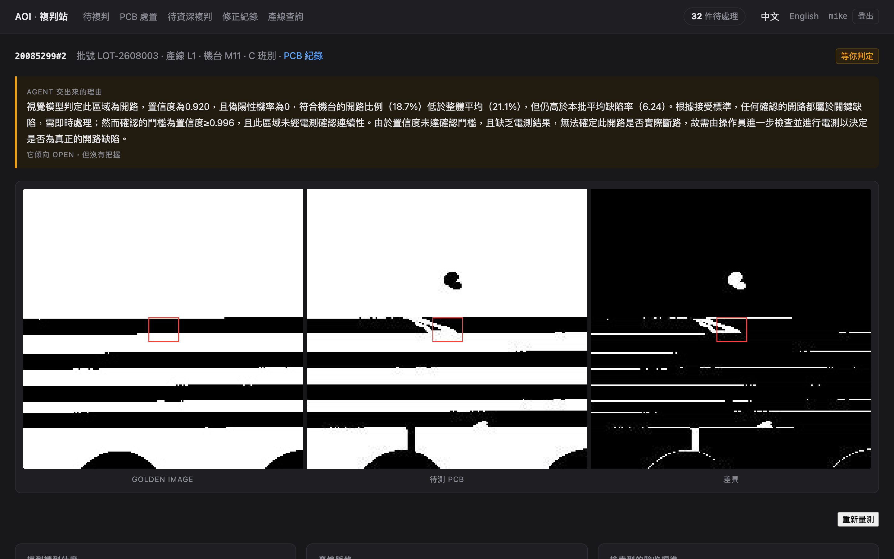
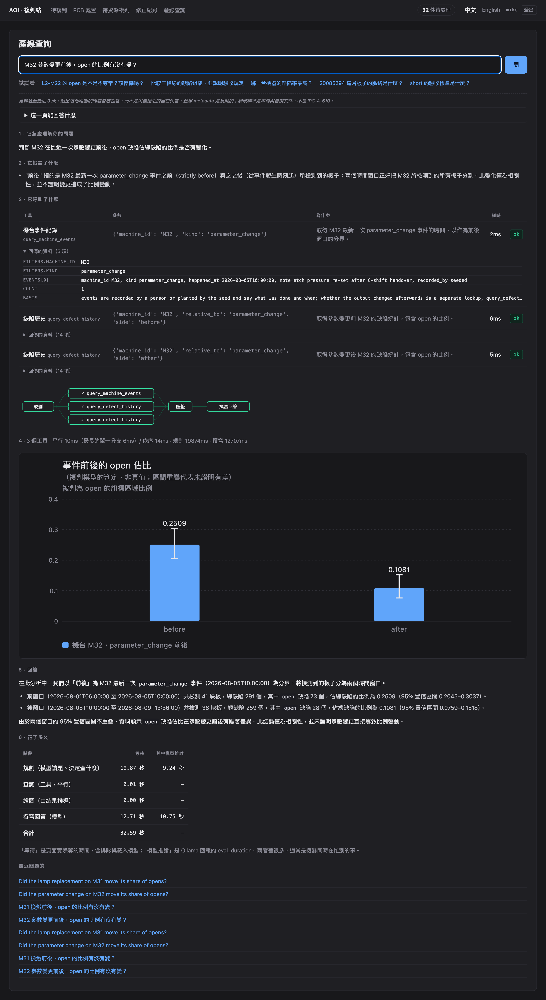
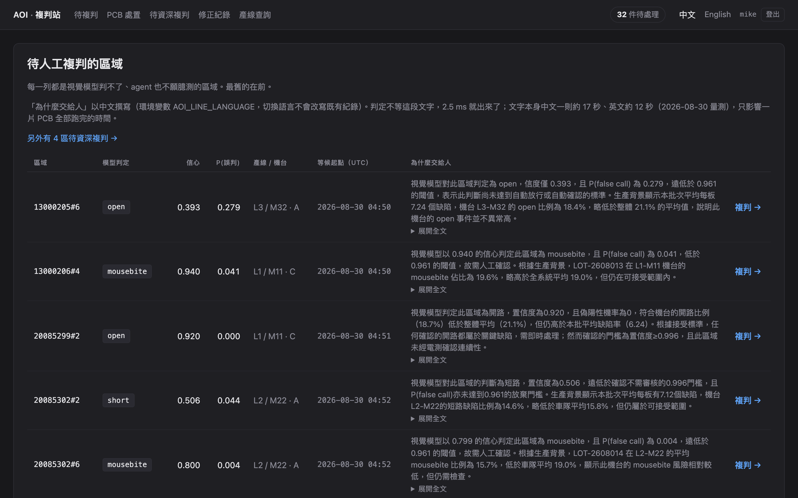
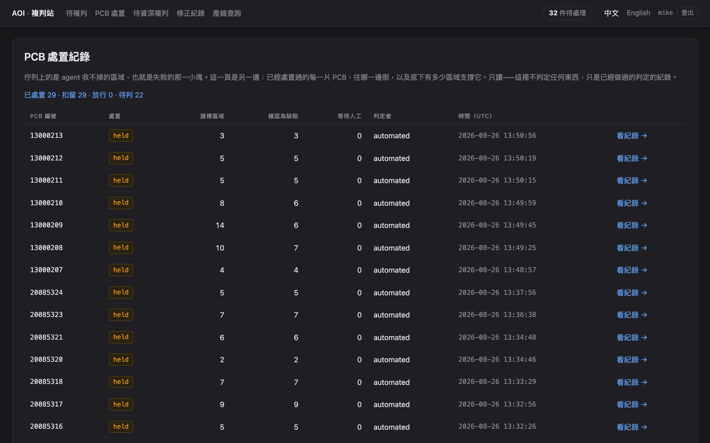
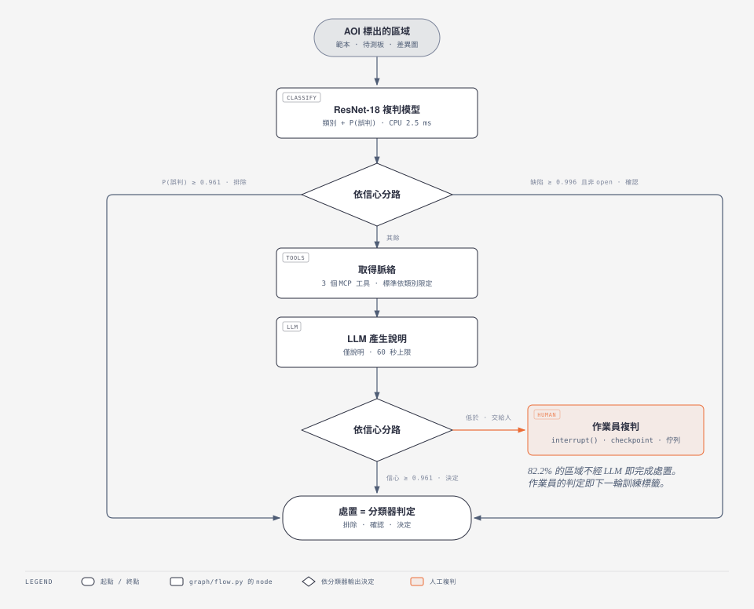
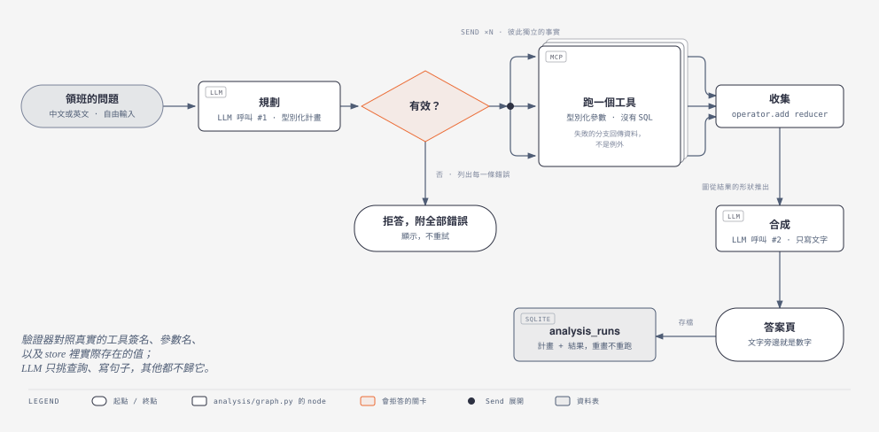

# AOI-Agent

**AOI（自動光學檢測）是產線上拍照找電路板瑕疵的機器，設定上為了不漏檢而寧可誤報：
它標出的區域，六成是誤報，而今天每一個都要人看過。**
本系統把視覺模型放在這條佇列前面、agent 放在後面，兩者都判不了的才交給作業員。

**人工複判減少 55.6%**，該門檻下的漏檢率是 0.66%，對照 0.5% 的預算——這份 README
會告訴你這個預算**沒有達標**，以及為什麼。每個門檻都引用挑出它的腳本，每個數字都
指名它來自哪一次量測。

[](https://github.com/lin891020/aoi-agent/actions/workflows/tests.yml)


&nbsp; **[English version →](README.md)**

## Demo

https://github.com/user-attachments/assets/36cb4982-3504-4fc2-ace5-9be595d755b9

六分鐘走完全程：AOI 是什麼 → CLI 跑一片板 → 複判佇列 → 一個區域與 agent 的交付理由
→ `0`（無法判斷）與資深複判 → `/ask` 查機台事件與對照機台 → 語言切換 → 數字。

[繁體中文（6:10）](https://github.com/user-attachments/assets/36cb4982-3504-4fc2-ace5-9be595d755b9)・[English（5:48）](https://github.com/user-attachments/assets/62797dbf-f9d6-4bc8-974c-c7ef0217d0ae)・[無聲版與下載](https://github.com/lin891020/aoi-agent/releases/tag/demo-2026-09-07)・[分鏡](docs/demo-script.md)

<sub>旁白是合成的（Kokoro-82M 與 Qwen3-TTS）。示範資料是公開的 DeepPCB：AOI 是相減
模擬器、產線紀錄是種下去的——影片裡有說。</sub>

**一個區域，作業員看到的樣子**——golden image、待測 PCB、差異圖；模型的判讀與它實際
看的 64 px 小圖；只屬於該類別的允收標準；以及刻意不顯示的標準答案。



**`/ask`**——主管的問題轉成經過驗證的型別化查詢計畫，展開執行，圖表由結果的形狀推得，
文字裡的每個數字都對回它旁邊的結果。



<details>
<summary>佇列與板子索引</summary>





</details>

每一頁皆有 English 版。

## 概要

| 項目 | 摘要 |
|---|---|
| **問題** | 產線 AOI 以 recall 為目標，過度標記。每個標記區域都由人複判，多數為 false call。 |
| **方法** | ResNet-18 複判模型為每個 candidate 評分。LangGraph flow 對不確定者取得脈絡與 LLM 說明，判不了的透過可持久化的 `interrupt()` 升級給作業員。第二入口 `/ask` 將主管的問題轉成經驗證的型別化查詢計畫與圖表。 |
| **資料** | [DeepPCB](https://github.com/tangsanli5201/DeepPCB) 官方切分：499 片測試板、7,322 個 candidate，41.2% 為真實缺陷。False call 由範本相減產生，非人工編造。 |
| **結果** | **省去 55.6% 的人工複判**，門檻以 out-of-fold 選出，從未在報告它的那份切分上挑過。該門檻下 escape rate 為帶缺陷標籤 candidate 的 0.66%（95% 區間 0.43%–1.02%），對照 QP-110 的 0.5%：**在這個讀法下未達標**。若按缺陷計——QP-110 的原文寫法——複判模型漏判 0.35%，整線 0.51%。這是單一 seed：整套流程重跑五次，中位數為 0.50% 下省去 50.9%，範圍 49.0%–55.6%（[重跑會落在哪](#重跑會落在哪)）。 |
| **技術** | Python 3.12 · PyTorch（MPS / CPU）· LangGraph · MCP · FastAPI + Jinja · SQLite · Ollama（`gpt-oss:20b`） |
| **驗證** | 1,462 個測試，不需模型或 GPU。每個門檻皆引用出處；每個數字皆註明產生它的腳本。 |
| **限制** | 照片板材上，相減前端無法通過第一道閘門；錫膏影像上，YOLO26n 偵測器可定位 92% 的缺陷，但排序只能省 1.2%。見[遷移](#遷移兩份新資料集)。 |

## 快速開始

**需要** Python 3.12、[uv](https://docs.astral.sh/uv/)，以及
[Ollama](https://ollama.com) 加一個會 tool calling 的 model（預設
`gpt-oss:20b`）來寫說明。macOS Apple silicon（torch 走 MPS）或 Linux/CPU 皆可，
不需要 GPU。抓十分鐘，大部分花在訓練。

```bash
git clone --depth 1 https://github.com/tangsanli5201/DeepPCB.git data/DeepPCB
uv sync
uv run python scripts/build_patches.py --split trainval && uv run python scripts/build_patches.py --split test
uv run python scripts/train.py                           # M5 Air 約 4 分鐘 -> models/reverifier.pt
uv run python scripts/seed_store.py --split test --limit 500
uv run python scripts/add_operator.py mike --role senior # 會問通行碼
uv run python -m aoi_agent board 00041208 --queue        # 一片板子走完整條 flow
uv run python -m aoi_agent station                       # http://127.0.0.1:8110
```

`board` 每個標記區域印一行，而最後兩行就是這整個專案的重點：

```text
board 00041208: 30 AOI candidates
  00041208#0       DISMISSED  false_call   by model
      path: classify -> dismiss
      classify 44ms
  ... 另外 27 個區域由 model 或 agent 判完，各幾毫秒 ...
  escalated: 00041208#8
      reason: 模型把這個區域判為 false_call，機率 0.892，低於站台設定的 0.912
      解除閾值，亦低於 0.947 的高信度閾值，故不會自動放行 ...
  00041208#8       QUEUED     already waiting on an operator
  00041208#15      QUEUED     already waiting on an operator

  board 00041208: not dispositioned -- regions are still waiting on a person
```

`uv run pytest` 不需要 model、GPU 或資料集就能跑完。所有量測腳本、容器與完整 CLI：
[怎麼跑](#怎麼跑)。

<details>
<summary><b>目錄</b></summary>

**量測** — [結果](#結果) · [量測改變了什麼](#量測改變了什麼) · [遷移：兩份新資料集](#遷移兩份新資料集) · [一個 candidate 要多少錢](#一個-candidate-要多少錢)

**系統** — [怎麼運作的](#怎麼運作的) · [複判站](#複判站) · [問產線問題](#問產線問題--ask) · [Tools](#tools) · [怎麼跑](#怎麼跑)

**誠實的那部分** — [已知限制](#已知限制) · [還沒做的](#還沒做的)

</details>

## 結果

DeepPCB 官方測試切分：499 片未見過的板、7,322 個 AOI candidate，其中 3,018 個（41.2%）為真實缺陷。

**出貨的門檻，以及它取代掉的 oracle。** 門檻是 0.912，在 trainval 上以
out-of-fold 選出——依影像五折、6,569 個缺陷支撐這個選擇，取「95% 區間上緣」
而非點估計滿足預算的最低門檻（`scripts/threshold_cv.py`）。

| | 門檻 | escape rate（按 candidate） | 95% 區間 | 省去的人工複判 |
|---|---|---|---|---|
| **出貨** — out-of-fold 選出 | 0.912 | 0.66% | 0.43%–1.02% | **55.6%** |
| 此切分上的 oracle — 不可出貨 | 0.961 | 0.50% | 0.30%–0.82% | 52.8% |

#### 重跑會落在哪

上面每一個數字都來自單一 seed，而 seed 會動到依影像的切分、初始化、洗牌順序，
以及選擇程序回傳的門檻。五個 seed，每一個都把整套流程從頭跑一次：

| | 門檻 | 測試 escape | 省去的人工複判 | 同一顆模型的 oracle |
|---|---|---|---|---|
| seed 0 — **出貨的** | 0.912 | 0.66% | **55.6%** | 52.8% |
| 五個的中位數 | 0.949 | 0.50% | **50.9%** | 51.4% |
| 範圍 | 0.912–0.978 | 0.33%–0.66% | 49.0%–55.6% | 49.7%–52.8% |

最後一欄是每個 seed 在此切分上的最佳門檻——不可出貨，但它把操作點釘在預算上，
所以只隨模型變動。**離散度大約一半來自模型、一半來自選擇規則落在曲線上的位置**：
3.1 點對 6.6 點。出貨的是 seed 0，而它在兩個軸上都是五個裡最好的。

兩種區間，不是同一種區間。單一 seed 之內，escape rate 帶著 Wilson 區間，那是固定
模型上的抽樣誤差；跨 seed 則是整套程序在動。`scripts/seed_variance.py`。

第二列是本文件在 2026-08-31 之前的頭條。當時一份資料同時做了兩件事：選操作點，
又報成績。作為**引擎之間**的比較這是公平的——各給一個 oracle——下面的掃描表也正是
為此保留。它唯一不能同時擔任的是出貨數字，因為那個點是看著它被引用的那份切分挑的。

| escape budget | 此切分能達到的最佳 | 省去的人工複判 |
|---|---|---|
| ≤0.25% | 0.23% | 40.2% |
| ≤0.50% | 0.50% | 52.8% |
| ≤1.00% | 0.99% | 58.3% |

- **為什麼是曲線不是準確率。** 漏判讓缺陷板出貨；false call 只多花作業員幾秒。準確率
  把兩者等重看待，對這條線是錯的。（準確率 96.5%，供參考。）
- **兩個 rate，兩個都印。** 0.66% 計的是被 dismiss 掉、帶缺陷標籤的 *candidate*
  （3,018 中的 20 個）；改計*缺陷*，也就是 QP-110 的原文寫法，複判模型漏 0.35%、
  整線 0.51%。兩種讀法都不是拿來單獨引用的那個好看數字。
- **挑門檻的那份資料預測不了部署的那份。** 挑出 0.912 的流程在 out-of-fold 上估
  0.32%，這份切分量到 0.66%，約兩倍，每一個試過的門檻都是同一個倍率，兩邊的類別組成
  也一樣。預算沒達標不是調參失誤——是 trainval 的板子比官方測試板容易，而這個模型上
  沒有任何門檻補得上。
- **路由與盛行率。** 85.9% 的 candidate 只由複判模型處置，每個 2.5 ms；LLM 只被叫用
  在剩下的 14.1%。前一版頭條 56.2%（8,143 個 candidate）量測於對位階段之前，
  2026-08-26 作廢——複判減量的數字要連同它假設的盛行率一起報。

完整報告：[docs/benchmarks.md](docs/benchmarks.md)，只增不改、新的在後。區間與分類別細節：
[prevalence](docs/benchmarks.md#prevalence--what-survives-a-line-that-is-not-this-dataset-1)
· [per-class escape](docs/benchmarks.md#per-class-escape--one-budget-over-six-classes-that-are-not-alike-1)。

## 量測改變了什麼

六項量測推翻了先前的主張或設計決定，每一項都改了程式。下表每項一列；完整經過與
改前改後的數字在 [docs/findings.zh-TW.md](docs/findings.zh-TW.md)。
同一條路做成投影片：[docs/deck/](docs/deck/) —— 每個實驗的為什麼做／怎麼設計／量到什麼／錯在哪／規則，附面試官會問的題；從 `scripts/deck_content.py` 產生，投影片上的數字必須是文件裡發表過的。

| 量了什麼 | 量到什麼 | 改了什麼 |
|---|---|---|
| LLM 在 decision path 上 | 同一批 60 個區域，LLM 43/60、classifier 51/60；LLM 改了 12 次判斷、對 1 次 | 它只解釋、不再決定；`test_the_classifier_class_stands_when_the_llm_disagrees` 守著 —— [完整版](docs/findings.zh-TW.md#llm-本來在-decision-path-上量過之後把它拿掉了) |
| Planner，用作者沒看過的 70 題打分 | 55/70；膽小不亂判（28/28 拒答全對）；之後加了兩個 tool，題庫一字未動、每次重考 | 題庫不改，miss 逐題裁定；2026-08-28 改 prompt 後重跑 —— [完整版](docs/findings.zh-TW.md#planner-是用它作者沒看過的題目打分的) |
| plan 對之後那段文字，對照 payload | 265 句、602 個數字：沒有一個是編的、沒有一個掛錯對象；第一輪 43 件裡 41 件是 checker 自己的錯 | 每個 checker 修正兩邊都有測試 —— [完整版](docs/findings.zh-TW.md#plan-對之後那段文字有沒有照著資料寫也量了) |
| 標準檢索 | 27.8% 的段落來自別的 class 的 work instruction；disposition path 把 pin hole 的規則拿給作業員判 open | 每份文件宣告自己管哪一類、檢索帶 scope：現在 0.0% —— [完整版](docs/findings.zh-TW.md#標準檢索把別的-defect-class-的規定當成這一類的答案) |
| 兩個 threshold 的出處 | `ESCALATE_BELOW` 引一個沒人跑過的 sweep；`CONFIDENT` 引一條沒有數字的條款 | 兩個都 sweep 了；`ESCALATE_BELOW` 在結構上等於 dismiss threshold；29 個測試守每一個引用 —— [完整版](docs/findings.zh-TW.md#兩個-threshold-的出處其實沒寫那件事) |
| 全線 escape rate | 發表 5.4%；實際 0.51%，而且是兩個數字（0.16% 沒標到、0.35% 判掉） | 一個「框得多緊」的統計量被當成漏檢率 —— [完整版](docs/findings.zh-TW.md#全線-escape-rate-被高估了將近一個數量級) |

## 遷移：兩份新資料集

DeepPCB 已對位、已二值化，等於把現實產線兩個最大的 false call 來源拿掉了。所以出貨
的 pipeline 原封不動地跑上兩份從沒為它掃過門檻的資料集。**兩個答案都出現在比問題更
前面一層。**

| | 是什麼 | 發生了什麼 |
|---|---|---|
| **HRIPCB** — 照片 | 10 片真實板、693 張影像，外加同樣 693 張旋轉 ±10° | 相減前端在出貨門檻下只標出 **16.9%** 的缺陷，S0 gate 在*任何*設定下都過不了。把門檻設在 recall 最高處，複判模型 dismiss 掉 **2,953 個真缺陷裡的 1,387 個**。 |
| **PCB-AoI** — 錫膏，無樣板 | 真實 SMT 影像；元件放置本來就有公差，沒有東西可以相減 | YOLO26n 涵蓋 **91.6%** 的缺陷，但在 ≤0.5% 預算下只排得掉 **1.2%** 的佇列。它的 crop 再接一個複判模型（2026-08-28）只到 **2.8%**，天花板是 22.3%。 |

三個發現，沒有一個是這個實驗原本要測的：

- **相減前端的適用範圍是二值化影像**，而這個專案在量到之前沒有任何地方講過這件事。
  DeepPCB 會過，是因為二值化讓「缺陷」和「沒對準的邊」變成同一個 255 階的差異；在
  照片上缺陷是 36 階的差異，而每一條邊都是漸層。
- **偵測器的 confidence 是一個附了類別頭的定位分數**，不是校正過的 P(false call)
  ——所以那條前端沒有複判階段。兩條線、兩種盛行率，所以這些數字不是排名，形狀才是發現。
- **在這份資料上，光看外觀分不開 false call 和缺陷**，兩條前端都一樣。這就是相減
  pipeline 帶樣板通道的原因：它從來不是為了方便。
- **對位階段拒絕了 693 對旋轉配對裡的 563 對**，如設計所然。它只修平移，而且修不了
  的時候會說。

這些都還沒證明的事：一顆從沒在照片上訓練過的 checkpoint、一個看過結果才挑的灰階
門檻、六十張測試影像帶來的寬區間、單一 seed。`scripts/transfer_report.py`、
`scripts/gate_check.py --dataset hripcb` 與 `scripts/detector_report.py` 重建每一個數字。
→ [gate](docs/benchmarks.md#s0-gate-on-hripcb--does-template-differencing-produce-a-reviewable-queue-on-photographs)
· [遷移](docs/benchmarks.md#transfer--the-shipped-pipeline-on-hripcb-a-dataset-it-was-never-swept-on)
· [偵測器](docs/benchmarks.md#detector-front-end--yolo26n-on-pcb-aoi-read-at-the-escape-budget)
· [crop 複判器](docs/benchmarks.md#crop-re-verifier--the-resnet-18-over-the-detectors-boxes-against-the-detectors-own-ordering)

## 怎麼運作的

一個標記區域，從頭到尾。圖由 `scripts/render_diagrams.py` 讀取 `graph/flow.py` 的
node 名稱與門檻產生，所以不會跟程式碼脫節。

<picture>
  <source media="(prefers-color-scheme: dark)" srcset="docs/diagrams/disposition-flow-dark.zh-TW.svg">
  
</picture>

<sub>處置流程。由 `scripts/render_diagrams.py` 讀取 `graph/flow.py` 的 node 名稱與門檻產生。`/ask` 的流程圖見[問產線問題](#問產線問題--ask)。</sub>

底下是同一條 flow 的文字版，然後是圖上看不出來的那幾件事。

<details>
<summary>同一條 flow 的文字版</summary>

```
template ─┐
          ├─→ difference + threshold + connected components ──→ candidates
test ─────┘            "AOI simulator"                              │
                                                                    ▼
                                                        ResNet-18 re-verifier
                                                     class + calibrated P(fc)
                                                                    │
                        ┌───────────────────────────┬───────────────┴───────────┐
                        ▼                           ▼                           ▼
                P(false call) ≥ .915          conf ≥ .95 and a          everything else
                                            defect other than `open`            │
                        │                           │                           ▼
                        │                           │              production context
                        │                           │            + criteria for that class
                        │                           │               (three MCP tools)
                        │                           │                           │
                        │                           │                           ▼
                        │                           │            LLM writes the rationale
                        │                           │                           │
                        │                           │                  conf ≥ .915 ?
                        │                           │              ┌────────────┴──────────┐
                        ▼                           ▼              ▼                       ▼
                     dismiss                     confirm    classifier's class      escalate to
                                                                  stands            an operator
```

（這段文字裡的 threshold 是 2026-08-23 出貨時的；上面那張圖由
`scripts/render_diagrams.py` 產生時直接讀 `graph/flow.py` 現在的常數——2026-08-31 起是 0.912，以及
它上面的 `CONFIDENT` 帶。）

</details>

圖上每一個 disposition 都是 classifier 下的。2026-08-23 之前，中下那個框寫的是「LLM
的 verdict」，而 escalate 那條邊是照 LLM 自己對自己信心的判斷走的；兩個都拿去跟它們
想取代的 classifier 比過，兩個都輸，兩個都拿掉了。LLM 的輸出現在只到一個地方 ——
作業員螢幕上那段話。

### False call 是哪來的

DeepPCB 裡只有真的 defect，所以複判 model 本來沒有東西可以「判掉」。與其自己編
false call，這個 pipeline 是把它**產生**出來的：用一個單純的 template differencing
偵測器 —— 跟真 AOI 同一個原理 —— 產生高 recall 的 candidate，再拿去跟 ground truth
的框比對，逐一標成真 defect 或 false call。

在完整 trainval split 上量：recall 95.3%，每片板子 7.07 個 false call。這個 recall
用的是 DeepPCB 自己的 IoU 0.33 慣例，所以它同時是一個「框得緊不緊」的數字 —— 在 test
split 上，偵測器在 99.78% 的 defect 上都放了 candidate，只是有不少框得比標註者鬆。
兩個數字都在 [docs/benchmarks.md](docs/benchmarks.md)。

只是把一個真 defect **切碎**的 candidate 會被排除在訓練外，而不是標成 false call。
量過那類佔未匹配框的 6.1%，拿去訓練等於教 model 把真 defect 判掉。

### 為什麼是 graph 不是迴圈

單看 confidence gate，一個 `while` 迴圈就夠了。難的是交給人的那一段：被 escalate 的
candidate 要中途暫停、把狀態整包存下來，然後在作業員有空的時候恢復 —— 可能是幾天以
後，而且不能重跑任何 tool。這就是 LangGraph 的 checkpointer 跟 `interrupt` 在做的事。

它對頭條數字也有影響。≤0.5% 的 escape budget 是靠「不確定的送人」達成的，不是靠
model 夠強。把 escalate 這條邊拿掉，同樣的 budget 就得用複判量去換。

## 複判站

Escalation 進佇列，作業員有空的時候回答。產線不會為了一個 prompt 停下來。

```bash
uv run python -m aoi_agent board 20085294 --queue   # 跑一片板，收不掉的進佇列
uv run python -m aoi_agent station                  # http://127.0.0.1:8110
```

站台給作業員看的是 **agent 手上有的證據**：golden image、待測 PCB 與差異圖並排，
標記框畫出來；模型的類別、信心值與 P(false call)，外加它實際分類的那張 64 px 小圖
——這樣意見不合可以被讀成裁切的問題而不是分類器的問題；只屬於該類別的生產脈絡與允收
標準；以及 agent 為什麼不判。

四個值得爭論的決定：

- **它永遠不顯示 ground truth。** 作業員的答案是下一輪訓練的標註，而照著答案抄的
  標註一文不值。這條擋在 dict 邊界上，不是靠 grep 樣板。
- **它永遠不為了畫一頁而重跑 flow。** 暫停的狀態就在 checkpointer 裡，讀它只要一次
  磁碟定位，而不是再一次 20B 推論、還可能跟畫面上已有的說明打架。
- **前門不是佇列**（2026-09-05 起）。`/` 是六個 `COUNT(*)` 數字與三道門，佇列在一個
  click 之後。一道開在「agent 收不掉的區域」上的門，會讓讀者先看到失敗，然後把失敗
  當成整個系統。
- **`0` 是「我判不出來」。** 它不寫任何判定——那張表是下一輪的標註，而「不確定」是唯一
  絕對不能當標註的東西——並把區域移到只有 `senior` 能回答的清單，因為交給下一個一般
  作業員就是交給已經失敗過的那個判斷。這是站台唯一的權限，而且角色是每次 request 都
  從憑證檔重讀，所以撤銷立刻生效。

作業員登入，而**他登入的那個名字就是標註上的名字**；store 會拒絕一筆講不出是誰做的
human 判定，而且那一列會記下名字是怎麼建立的（`signed_in`，或 CLI 的
`host_account`），讓重訓那一輪可以據此篩選。作業員全部住在一個檔案裡
（`scripts/add_operator.py`），這就是全部的使用者管理，刻意如此。這套機制擋不住什麼
是寫下來的，不是含糊帶過——見[已知限制](#已知限制)。

判定用一般的 form 送出再導向，所以關掉 JavaScript 也能用。每一頁都有繁中與英文，而
切換只換 chrome、永遠不改寫紀錄。時間戳存 UTC、顯示 UTC，而且頁面上有寫。

→ [Escalation 的兩個 store、持久性測試，以及一筆判定要指名什麼](docs/architecture.md#where-an-escalation-waits)

## 問產線問題 —— `/ask`

第二個入口，給不同的人。佇列回答「這個區域我該怎麼辦」；`/ask` 回答輪班主管的問題
——「M22 是不是在漂，這重不重要」。它讀的是處置路徑同一批 MCP 工具，而且不處置任何
東西。

<picture>
  <source media="(prefers-color-scheme: dark)" srcset="docs/diagrams/analysis-flow-dark.zh-TW.svg">
  
</picture>

一次 LLM 呼叫產生一份型別化的查詢計畫。`validate_plan` 在任何東西執行之前檢查三層
——工具名、參數名對照真實 signature、以及參數*值*對照 store 實際持有的值域——沒過的
計畫連同每一個錯誤攤給人看，不重試。通過的呼叫用 `Send` 展開，失敗的分支回傳資料而
不是拋例外，**圖表由結果的形狀推得而不是由模型挑**，第二次呼叫把文字寫在印在旁邊的
數字上。

展開是工作本身的形狀，不是為了加速：兩次模型呼叫在時間上以數量級輾壓其他部分，所以
這裡沒有任何地方把它說成加速。

規劃器做得多好，是一份 [70 題、出題者沒看過 prompt 的盲測](docs/findings.md#the-planner-was-graded-on-questions-its-author-never-saw)；
它寫的文字是不是忠於資料，是後面那一節。

### 唯讀的 text-to-SQL，當作實驗

這一節在 2026-08-29 之前的標題是*為什麼沒有 text-to-SQL*，而它給的理由到現在還成立：
一句語法正確但語意錯誤的查詢會回一個看起來合理的數字、不報任何錯，而看起來合理的錯
數字會被拿去做事。型別化工具仍然是規則。

改變的是那份獨立題組揭露的事：七十題裡有六題落在沒有任何型別化工具組合得出來的維度
上，而且每一題都被拒絕。`run_sql` 為那些題目收一句 SELECT，而且它**帶著對照組**上線：
`AOI_SQL_TOOL=0` 把它移出 registry，同一份七十題兩邊各跑一次，用來決定它留不留。
2026-08-29 兩邊：有工具答 28/42、裁定後拒對 23/28；沒工具 25/42 與 25/28——五題拿到
了原本沒有的路徑，一題組合被弄丟、再用一句 prompt 補回來。重跑也生出了舊規則預言的
那種失敗：兩句合法、唯讀、有上限而且**錯**的 SELECT，各回一個數字。

讓它可被接受的是結構，不是一句叫模型小心的 prompt：SQL 跑在一份只含列出欄位的記憶體
副本上，所以 `ground_truth` 不是被濾掉、是根本沒被複製進去；連線是 `PRAGMA
query_only`；單一句、由 `sqlglot` 解析、資料表走白名單、任何碰得到檔案系統的函式一律
拒絕；200 列與兩秒；對一個沒有任何列持有的值做等值比較會被拒絕並列出實際存在的值；
跑出去的 SQL 印在它的結果上面；而在 registry 這一層，任何宣告查詢語言參數的工具必須
把它交給 `sql_guard.guarded_select` 而且只能交給它——這是在 import 時讀工具本體讀出來
的。守門層守不住的是*語意*，所以規劃器被告知它是最後手段。

→ [完整的分析路徑](docs/architecture.md#the-analysis-path) ·
[兩次裁定](docs/benchmarks.md)

## Tools

四個 MCP server，每一個都可以被任何 MCP client 單獨使用：

| server | tools |
|---|---|
| `aoi-classify` | `classify_defect`, `list_candidates` |
| `aoi-production` | `query_defect_history`（帶 `relative_to`/`side` 可取機台事件前後的視窗）, `query_machine_stats`, `query_board_context`, `query_false_call_rate`, `query_machine_events` |
| `aoi-standards` | `search_standards` |
| `aoi-sql-readonly` | `run_sql` —— 在沒有答案欄的唯讀副本上跑一句 SELECT；就是上面那個實驗 |

它們是 in-process 直接呼叫 model 跟 query，不是代理到一個 HTTP backend，所以 MCP 這
一層的成本量得出來，不會被藏在一次網路往返底下。

確認它們起得來、也把 tool 廣播出去：

```bash
uv run python scripts/check_mcp_servers.py
```

要從 Claude Desktop 用，加進 `claude_desktop_config.json`：

```json
{
  "mcpServers": {
    "aoi-classify": {
      "command": "uv",
      "args": ["--directory", "/path/to/aoi-agent", "run", "python",
               "-m", "aoi_agent.mcp_servers.classify"]
    },
    "aoi-production": {
      "command": "uv",
      "args": ["--directory", "/path/to/aoi-agent", "run", "python",
               "-m", "aoi_agent.mcp_servers.production"]
    },
    "aoi-standards": {
      "command": "uv",
      "args": ["--directory", "/path/to/aoi-agent", "run", "python",
               "-m", "aoi_agent.mcp_servers.standards"]
    }
  }
}
```

## 一個 candidate 要多少錢

Re-verifier 是一個吃 3×64×64（template、test、difference 疊起來）的 ResNet-18：
硬碟上 **42.7 MB、11.2 M 參數，CPU 上每個 candidate p50 2.50 ms**。計時涵蓋 pipeline
真正跑的那條路，含搬移，因為只計 forward 會把搬移藏起來，而那在 MPS 上不是免費的。

三個很容易被不小心改掉的結果：

- **Batch 1 的時候 GPU 是比較慢的那個** —— MPS p50 7.34 ms，慢 2.9 倍，因為 model
  這麼小的時候派下 forward 的成本比跑它還高。它要到 batch 8 才追上，所以複判站不該
  用 GPU，而一次判整片板子的 seeding 那支才該用。
- **持續 CPU 推論過了第一分鐘會掉約 20%**，這台是無風扇機器。第一分鐘和穩態要分開報。
- **CPU 的每 candidate 成本在 batch 8 之後會變差**好幾倍——那是 model 在 CPU 上
  convolution 路徑的性質，不是核心數的問題，換過 thread 數確認過。CPU 就 batch 8。

這一節先前寫「數十毫秒」，沒有量測依據；實測低了一個數量級。
→ [這次的 run](docs/benchmarks.md#re-verifier-latency--what-one-candidate-costs-and-on-what-hardware)

### 量化它，並且用 escape budget 的價格來算

INT8 兩種做法：dynamic，以及用 **training** split 抽出來的 512 個 patch 做校正的
static，兩個都在完整的官方 test split 上重跑，然後用這個專案唯一的讀法來讀。每個
引擎各拿*這份切分*在預算下能到的最好門檻——這讓引擎之間的比較公平，也讓這裡沒有一
個數字是部署數字；部署的設定在[結果](#結果)。

| ≤0.5% escape budget | 砍掉的複判 | 硬碟 | 常駐記憶體 | p50 |
|---|---|---|---|---|
| FP32 torch | **52.8%** | 42.7 MB | 389 MB | 2.53 ms |
| INT8 dynamic | 52.5% | 10.7 MB | 74 MB | 1.93 ms |
| INT8 static | **53.0%** | 10.8 MB | 81 MB | 0.65 ms |

**兩種 INT8 都守住了曲線**，兩個引擎差 0.5 個百分點，換算是 7,322 個 candidate 裡
15 對 12 個判定不同。活下來的發現不是「哪一種 INT8」，是 INT8 守得住 operating
point 這件事本身。它買到的是**記憶體，常駐從 389 MB 降到 74–81 MB**，因為 float32
那個 process 大部分是 torch runtime 而不是權重。不是延遲：平均一片板子 16.1 個
candidate，FP32 複判是一片板子 41 ms，而週期有十秒。

**判決在兩個 checkpoint 之間改變了。** 2026-08-26 之前這一節拒收 INT8 dynamic：在
前一個 checkpoint 上它丟了 1.3 個百分點，大約一個班別裡八十個區域回到作業員面前。
那個損失沒有活過 2026-08-24 的重訓，所以它是某一組權重的量化誤差，不是 dynamic 量
化的性質——這就是 `scripts/quantisation_report.py` 現在進了重訓鏈的原因：量化的判決
是對一組權重的判決。是量出來的，不是上線的：這台站台是一台沒有記憶體問題的筆電，
而已部署的 threshold 留在當初掃它出來的那個 model 上。

→ [這次的 run](docs/benchmarks.md#quantisation--what-int8-costs-at-the-escape-budget)

## 怎麼跑

這份 README 裡的每一個量測都是一支腳本，而每一支都往 `docs/benchmarks.md` 追加
——新的在後面，永遠不就地修改。

```bash
uv run python scripts/gate_check.py          # S0：相減找得到瑕疵嗎？
uv run python scripts/report.py              # operating-point 表
uv run python scripts/threshold_sweep.py     # 每個門檻買到什麼、付出什麼
uv run python scripts/seed_variance.py       # 整套流程重跑會落在哪
uv run python scripts/agent_eval.py          # agent 那一層贏得過分類器嗎？
uv run python scripts/analysis_eval.py       # 規劃器規劃得出正確的查詢嗎？
uv run python scripts/invariant_audit.py     # 這個專案自己的規則哪幾條沒人守
```

`uv run python -m aoi_agent --help` 列出 CLI：`board`、`queue`、`corrections`、
`explanations`、`provenance`、`station`。既有的 store 就地加欄位
（`scripts/seed_store.py --migrate-only`），因為裡面的更正是下一輪訓練的標註，不該
為了升級而重建掉。

**1,462 個測試。** 其中 1,437 個在乾淨 checkout 上就能在 CI 跑完——它們自己在 tmpdir
裡建 store、Chroma collection 與板子，並且把 model 換成 stub 而不是真的呼叫。另外 25
個需要磁碟上有資料集，帶 `dataset` marker；CI 每次跑完會把它們逐一列名，因為一個綠勾
蓋著一個悄悄縮小的測試集，正是那個 job 存在的理由。

### 用容器跑

```bash
docker build -t aoi-agent .
docker run --rm -p 8110:8110 \
  -v "$PWD/data:/app/data" -v "$PWD/models:/app/models" aoi-agent
```

資料集、patch、權重、store 與索引全部由腳本建立、全部 gitignore；它們從兩個 mount
進來，image 裡只有程式碼與 wheel。它不是的兩件事：**沒有 GPU**（Linux image 刻意拿
torch 的 CPU build——CUDA wheel 會為了這個專案從來沒有過的硬體拖進好幾 GB 的 runtime），
以及**沒有 model server**——Ollama 留在 host，所以容器要連得到它。

## 已知限制

都是量出來的，不是含糊的保留。每一條都是這個專案現在還是作品集、而不是明天就能上線
的理由。

**量測**

- **整線 escape rate 是 0.51%，而且它是兩個數字**：0.16% 的缺陷根本沒被標出來，
  0.35% 是被標出來之後又被 dismiss 掉。只有第二個才是門檻管得到的。
  [它曾經寫 5.4%](docs/findings.zh-TW.md#全線-escape-rate-被高估了將近一個數量級)。
- **不只分類別超標，連平均都超標了**，2026-08-31 起：`short` 1.77%、`open` 1.16%，
  對照整體 0.66%。它們是*有把握*的錯，所以模型自己的輸出上沒有任何切法分得開——電性
  測試可以，而 flow 不管 confidence 多高都把每個 `open` 送去 investigation，因為導通
  是二元的。
- **DeepPCB 是已對位、已二值化的**，等於把現實兩個最大的 false call 來源拿掉了，而它
  的缺陷也有一部分是疊上去的、不是自然發生的。
- **3×3 的 opening kernel 弄丟七個缺陷，而且它留下來**——要把它們找回來，每一個要付
  918 到 2,888 個額外的 false call，以及每片板子 1.6–8.5 倍的 candidate。
  [那次掃描](docs/benchmarks.md#the-opening-kernel--what-the-seven-lost-defects-would-cost-to-recover)。

**系統**

- **允收標準回答的是作業員問的另一個問題。** 加上 class scope 修好了段落來自哪份文件，
  沒修好那段落說了什麼：`open` 檢索到的規則是「已確認的 open 一律 critical」，那是怎麼
  *處置*，不是怎麼*確認*，而站在影像前面的人正在做的是確認。這變成文件的問題了。
- **生產脈絡是模擬的，含兩個植入訊號與三個對照。** Seeder 從不寫入缺陷，它決定的是哪
  片板子上了哪台機台。另外三台機台帶著*沒有*效果的事件，這樣工具被打的分數是「有沒有
  影響」而不是「有沒有事件」。
- **允收標準是為這個專案自撰的文件。** IPC-A-610 之類受著作權保護，刻意不放。

**人**

- **登入讓名字可歸屬，但沒有讓它為真。** 兩個人共用一組通行碼，兩個人的標註上會是同一
  個名字；cookie 是 bearer token；沒有鎖定機制；有 shell 的人可以直接寫 store。它足以
  用來衡量一個訓練標註，不足以在爭議裡用來要求誰負責——
  [完整說明](docs/benchmarks.md#the-scheme-and-what-it-does-not-protect-against)。
- **9,140 筆判定早於歸屬欄位，而且它們自己講了。** 它們寫 `unrecorded` 而不是 `NULL`，
  因為「沒人記錄是誰」跟「本來就沒有人」不能是同一列。第一輪重訓必須說清楚它丟下了
  store 的多少。
- **二十條 invariant 裡有兩條只守住一半，一條根本守不住。**
  `scripts/invariant_audit.py` 會說這個專案自己的哪些規則被破壞時真的會有測試變紅
  ——十六條有守、兩條部分、而「說清楚什麼是模擬的」被宣告為無法強制執行，而不是算它
  通過。每一條主張都是靠著真的去破壞它、看測試有沒有反應而確認的。
  [稽核與它的變異](docs/benchmarks.md#the-invariant-audit--which-of-this-projects-own-rules-are-unguarded)。

## 還沒做的

- **給偵測器前端一個排序。** 框上的複判器 2026-08-28 做出來了，在預算下省 2.8%，
  而那條佇列的上限是 22.3%——還不是排序。沒試過的：偵測器用 `imgsz=1280` 訓練（它的
  小目標設計就是為這個尺寸）；用一個*沒看過*訓練影像的偵測器產生裁切（在留出的 fold
  上訓第二個偵測器）；以及同一片板的第二次拍攝——那是唯一能給這條線一張範本的東西。
- **從作業員更正回頭 retrain。** 判定歷史有記（`uv run python -m aoi_agent
  corrections`），每一列寫得出是誰做的、那個名字怎麼建立的，所以下一輪可以只吃
  `signed_in`，或把其他的權重壓低。還沒有東西去用它；改變的是這個選擇存在了。
- **把量化後的 model 真的接上去**，這是一個決定，不是一個缺口。兩種 INT8 都守得住曲
  線、常駐記憶體少約 5 倍；沒接進站台是因為這台站台沒有記憶體問題，而延遲從來不是瓶
  頸。要接的話，需要在 `ReVerifier` 裡開一條 ONNX 路徑，並針對真正要服務的引擎重掃一
  次 threshold。
- **跨 model 比較**：`gpt-oss:20b`、`qwen3:14b`、`qwen2.5:14b`。reason node 的延遲只
  在一個 model 上量過；更小的 model 進不進得了 explanation deadline、還寫不寫得出堪用
  的理由，沒有量。
- **登入刻意沒做的那些。** TLS（cookie 是 bearer token，process 講的是明文 HTTP），
  以及登入端點的速率限制或鎖定。兩件都寫在 `station/auth.py` 裡，不會在沒有寫下理由
  的情況下加上去。

## 關於

一個作品集專案，2026-08-22 到 2026-09-08 之間為智慧製造 AI 職缺而做，所以它是照
「撐得住面試官追問」而不只是「跑得起來」寫的。不收 PR，但問題與更正歡迎開
[issue](https://github.com/lin891020/aoi-agent/issues)——這裡有任何一個數字追不回產生
它的腳本，那就是一個 bug。

作者：[Mike Lin](https://github.com/lin891020)・MIT 授權，見 [LICENSE](LICENSE)・
同一條路做成投影片、附面試官會問的問題：[docs/deck/](docs/deck/)
